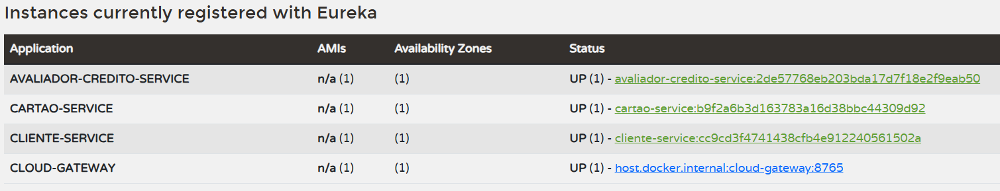
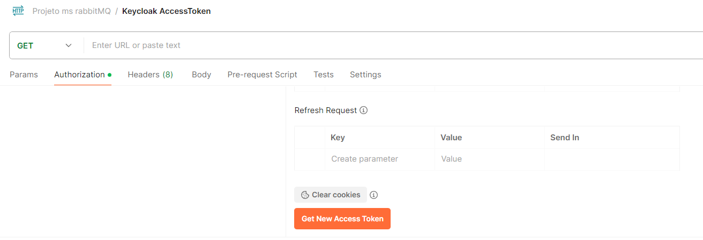

# microservicos-rabbitmq

Spring Cloud, Eureka, Microserviços, rabbitMQ, Keycloak - JAVA 21

# Como configurar e rodar a aplicação

### Como rodar o projeto inteiro no docker

- Empacotar os serviços com o comando "mvn clean package -DskipTests=true".
- No diretorio do arquivo docker-compose.yaml executar o comando "docker compose up".
- Realizar a configuração do RabbitMQ e Keycloak.

### Como rodar apenas o RabbitMQ e Keycloak para rodar o projeto local

- docker run --name rabbitmq-ms -p 5672:5672 -p 15672:15672 rabbitmq:3.13-management
- docker run --name keycloak-ms -p 8080:8080 -e KEYCLOAK_ADMIN=admin -e KEYCLOAK_ADMIN_PASSWORD=admin quay.io/keycloak/keycloak:25.0.1 start-dev
- Realizar a configuração do RabbitMQ e Keycloak.
- Rodar as aplicaçoes (o eureka-server deve ser executado primeiro).

### Como configurar o RabbitMQ

Acessar a url: http://localhost:15672

- user: guest
- password: guest

Criar uma fila em: Queues and Streams

- Type: Classic
- Name: emissao-cartoes

### Como configurar o Keycloak

Acessar a url: http://localhost:8080

- user: admin
- password: admin

Criar um realm:

- Create Realm -> importar o arquivo "files/realm-export.json"

Criar um cliente:

- Clients -> Import client -> Importar o arquivo "files/ms-credito.json"

Caso esteja utilizando o projeto inteiro no docker:

- Realm Settings -> Frontend URL -> http://ms-keycloak:8080

### Eureka Server

Eureka Server: http://localhost:8761

- user: ms-eureka-server
- password: err-vremss-keaue
- pode ser acessado para validar a integraçao com os microserviços

### Postman

Coleção do postman: files/msrabbitmq.postman_collection.json

Para testar a aplicação através do postman voce deve gerar o Access Token, copia-lo e utilizar como Bearer Token nas outras requisições.

